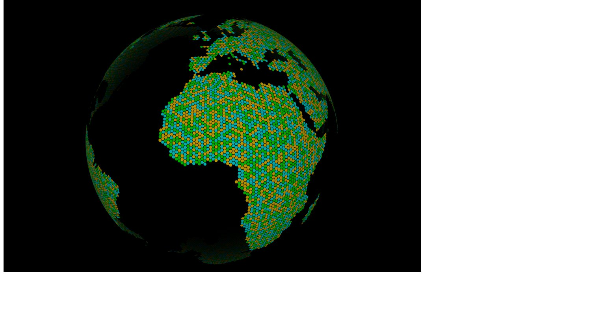

Hexasphere.js
=============
Would you like a sphere that is covered completely in hexagons of equal size?  Turns out that's not possible, but a sphere that is covered by all hexagons except for 12 pentagons is pretty straightfoward to contruct.  Starting with a icosohedron, subdivide each face to the appropriate resolution, project onto a sphere, and create the hexagons by connecting midpoints of the resulting triangles.  The corner tiles of the original icosohedron are pentagons, but the rest of the sphere will be covered by hexagons.

Its not perfect, but for many applications it is probably good enough.

This is a javascript implementation of the above method.  I use it to build the [Encom Globe](http://github.com/arscan/encom-globe), and it could be used for games or other "useful" applications. At the very least this might be useful as a reference implementation for people trying to something similar.



Usage
---------

The basic usage is as follows: 

```javascript
var radius = 15;        // Radius used to calculate position of tiles
var subDivisions = 5;   // Divide each edge of the icosohedron into this many segments
var tileWidth = 0.9;    // Add padding (1.0 = no padding; 0.1 = mostly padding)

var hexasphere = new Hexasphere(radius, subDivisions, tileWidth);
for(var i = 0; i< hexasphere.tiles.length; i++){
	// hexasphere.tiles[i].centerPoint contains x,y,z of the tile
	// hexasphere.tiles[i].boundary contains an ordered array of the boundary points
}
```

Check out a [demo on my website](http://www.robscanlon.com/hexasphere).  The demo uses three.js to render the sphere, but that is not an inherit dependency of hexasphere.js.

License
--------

The MIT License (MIT) Copyright (c) 2014 Robert Scanlon

Permission is hereby granted, free of charge, to any person obtaining a copy of this software and associated documentation files (the "Software"), to deal in the Software without restriction, including without limitation the rights to use, copy, modify, merge, publish, distribute, sublicense, and/or sell copies of the Software, and to permit persons to whom the Software is furnished to do so, subject to the following conditions:

The above copyright notice and this permission notice shall be included in all copies or substantial portions of the Software.

THE SOFTWARE IS PROVIDED "AS IS", WITHOUT WARRANTY OF ANY KIND, EXPRESS OR IMPLIED, INCLUDING BUT NOT LIMITED TO THE WARRANTIES OF MERCHANTABILITY, FITNESS FOR A PARTICULAR PURPOSE AND NONINFRINGEMENT. IN NO EVENT SHALL THE AUTHORS OR COPYRIGHT HOLDERS BE LIABLE FOR ANY CLAIM, DAMAGES OR OTHER LIABILITY, WHETHER IN AN ACTION OF CONTRACT, TORT OR OTHERWISE, ARISING FROM, OUT OF OR IN CONNECTION WITH THE SOFTWARE OR THE USE OR OTHER DEALINGS IN THE SOFTWARE.
